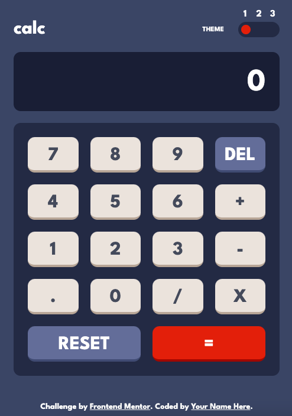

# Frontend Mentor - Calculator app solution

This is a solution to the [Calculator app challenge on Frontend Mentor](https://www.frontendmentor.io/challenges/calculator-app-9lteq5N29). Frontend Mentor challenges help you improve your coding skills by building realistic projects. 

## Table of contents

- [Overview](#overview)
  - [Screenshot](#screenshot)
  - [Links](#links)
- [My process](#my-process)
  - [Built with](#built-with)
- [Author](#author)

## Overview

### Screenshot

### Links

- Solution URL: [https://github.com/K-ost?tab=repositories](https://github.com/K-ost?tab=repositories)
- Live Site URL: [https://k-ost.github.io/Calculaor/](https://k-ost.github.io/Calculaor/)

## My process

### Built with

- Semantic HTML5 markup
- CSS3
- Flexbox
- Mobile-first workflow
- Native JavaScript

## Author

- Website - [github](https://github.com/K-ost?tab=repositories)
- Frontend Mentor - [@K-ost](https://www.frontendmentor.io/profile/K-ost)
